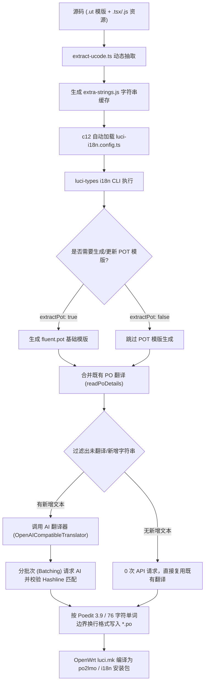

# LuCI / OpenWrt 多语言自动翻译配置与实现指南 (SKILL)

本 Skill 详细记录了如何为 OpenWrt / LuCI 前端项目（包含 TypeScript/JSX/JS 代码与 ucode 模版）配置与实现基于 AI（OpenAI 兼容接口）的智能化、增量化多语言自动翻译工作流。

---

## 1. 架构设计与编译流水线



---

## 2. 核心依赖安装与项目配置

### 2.1 NPM / PNPM 依赖准备

在项目中引入以下核心包：

```json
{
  "devDependencies": {
    "@lazulikao/luci-types": "github:LazuliKao/luci-types#main",
    "@dotenvx/dotenvx": "^1.38.0",
    "tsx": "^4.22.4",
    "typescript": "^6.0.3"
  }
}
```

在 `@lazulikao/luci-types` 工具包内部依赖：
- **`c12`**：UnJS 零配置加载引擎（内置 `jiti`，支持在 Node.js 环境下即时加载 `.ts` / `.js` / `.mjs` / `.json` 配置文件而无需预构建）。

---

## 3. 配置文件规范 (`luci-i18n.config.ts`)

在项目根目录下放置 `luci-i18n.config.ts`：

```typescript
import { defineConfig } from "@lazulikao/luci-types/i18n";

export default defineConfig({
  // 1. 项目包名与源码扫描路径
  packageName: "luci-app-example",
  input: [
    "htdocs/luci-static/resources",
    "src/script/.cache/extra-strings.js",
  ],

  // 2. POT 基础模版文件配置与提取开关
  pot: "po/templates/example.pot",
  extractPot: true,

  // 3. 默认开启 PO 增量合并 (重要：防止重新翻译已有文本)
  merge: true,

  // 4. AI 翻译器配置
  translate: {
    enabled: true,
    translator: "openai",
    batchSize: 15,
    prompt: "src/script/translate.${locale}.md", // 支持 ${locale} 自动路由与 fallback
  },

  // 5. 通用 PO 标头配置 (默认空字符串，不添加去除无意义的占位符)
  headers: {
    languageTeam: "LuCI Development Team",
  },

  // 6. 多语言矩阵配置 (按 OpenWrt 标准 ISO 命名)
  locales: [
    { locale: "zh_Hans", po: "po/zh_Hans/example.po" },
    { locale: "zh_Hant", po: "po/zh_Hant/example.po" },
    { locale: "es", po: "po/es/example.po" },
    { locale: "fa", po: "po/fa/example.po" },
    { locale: "ru", po: "po/ru/example.po" },
    { locale: "de", po: "po/de/example.po" },
    { locale: "fr", po: "po/fr/example.po" },
    { locale: "ja", po: "po/ja/example.po" },
    { locale: "ko", po: "po/ko/example.po" },
    { locale: "tr", po: "po/tr/example.po" },
    { locale: "uk", po: "po/uk/example.po" },
    { locale: "vi", po: "po/vi/example.po" },
    { locale: "it", po: "po/it/example.po" },
    { locale: "pl", po: "po/pl/example.po" },
  ],
});
```

---

## 4. AI Prompt 模版设计与 Fallback 机制

### 4.1 提示词文件路由模式
当 `translate.prompt` 配置为 `src/script/translate.${locale}.md` 时：
1. `luci-types i18n` 优先查找 `src/script/translate.<locale>.md`（如 `translate.ja.md`）。
2. 若语言专属文件不存在，自动平滑 fallback 回退至通用 `src/script/translate.md`。
